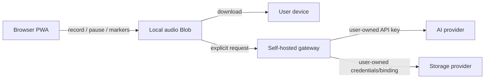

# Plaucket Public

**Privacy-first, self-hosted meeting recording with bring-your-own AI and storage.**

Plaucket Public records from the browser, lets you download the original audio locally, and only sends data to services you configure.

- No Plaucket account
- No mandatory subscription
- No telemetry
- No embedded API keys
- Bring your own AI credentials
- Bring your own storage
- Docker and Cloudflare deployment paths

> Early release. Test with non-sensitive meetings first, obtain recording consent, and review `SECURITY.md` before production use.

## Supported provider model

### AI
The gateway uses server-side user-supplied credentials. OpenAI is the reference adapter today; the provider layer is structured so other transcription and LLM backends can be added without exposing keys to the browser.

### Storage
- Local persistent server storage
- Cloudflare R2 through a Worker binding
- Additional storage adapters can implement the common interface in `shared/gateway.ts`

The browser never receives cloud storage credentials.

## Architecture



## Quick start

Requirements: Node.js 24+ and npm.

```bash
git clone https://github.com/leongxudong/Plaucket_Public.git
cd Plaucket_Public
npm install
cp .env.example .env
# edit .env
npm run build
set -a && . ./.env && set +a
npm start
```

Open `http://localhost:8788`.

## Configuration

```env
OPENAI_API_KEY=replace-me
PLAUCKET_ACCESS_TOKEN=replace-with-a-long-random-value
OPENAI_TRANSCRIPTION_MODEL=gpt-4o-mini-transcribe
OPENAI_ANALYSIS_MODEL=gpt-4o-mini
LOCAL_STORAGE_PATH=./storage
PORT=8788
```

The included implementation uses OpenAI as the reference AI provider, but all credentials are supplied by the user at deployment time. Storage is local or Cloudflare R2 in v0.1. Additional adapters are intentionally isolated behind interfaces so users can add their own provider.

## Privacy model

1. Recording starts only after browser microphone permission.
2. Audio remains in browser memory until you explicitly transcribe, save, download, or discard it.
3. AI requests go through your own gateway; API keys remain server-side.
4. Cloud save occurs only when you press Save.
5. Plaucket includes no analytics or advertising SDKs.

Your chosen infrastructure providers still process data under their own terms.

## Security

Do not put secrets in frontend source, committed workflow files, or checked-in `.env` / `.dev.vars` files.

For internet-facing deployments, place an identity-aware proxy such as Cloudflare Access in front of the gateway. The optional shared access token is a simple safeguard, not a multi-user identity system.

See [SECURITY.md](SECURITY.md).

## Roadmap

- OpenAI-compatible custom AI endpoint configuration
- S3-compatible storage adapter
- Additional AI adapters
- Google Drive / OneDrive adapters
- Chunked transcription for long recordings
- IndexedDB crash recovery
- Speaker diarisation
- OAuth/OIDC for multi-user deployments
- Client-side encryption before cloud storage

## License

MIT © Xudong Leong
